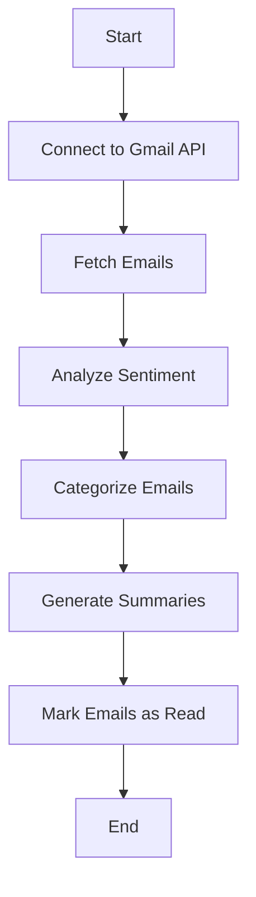

# Email Agent Architecture Plan

## Overview
This document outlines the architecture for an email agent that reads, analyzes, categorizes, and summarizes emails from Gmail.

## Workflow Diagram

## Components Breakdown

1. **Connect to Gmail API**: 
   - Use OAuth2 for authentication.
   - Libraries: `google-auth`, `google-api-python-client`.

2. **Fetch Emails**: 
   - Retrieve emails based on specific criteria (e.g., unread emails).
   - Libraries: `google-api-python-client`.

3. **Analyze Sentiment**: 
   - Use spaCy, TensorFlow, NLTK, and TextBlob for sentiment analysis.
   - Determine if the sentiment is positive, negative, or neutral.

4. **Categorize Emails**: 
   - Categorize based on sender and content.
   - Define rules for priority categorization.

5. **Generate Summaries**: 
   - Create detailed summaries of the emails.
   - Use NLP techniques to extract key information.

6. **Mark Emails as Read**: 
   - Update the email status in Gmail to read while keeping them in the inbox.